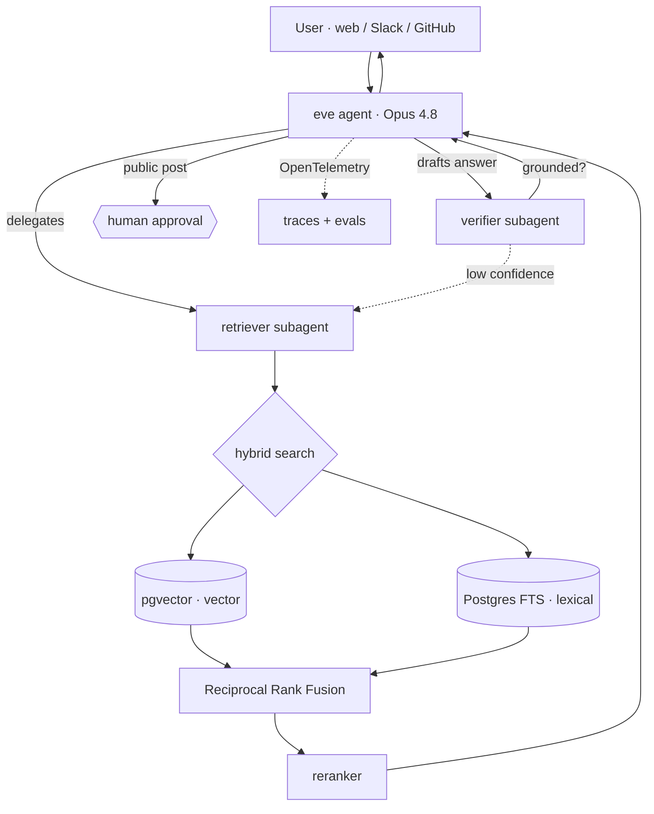

<div align="center">

# 🜂 eve-sage

### An [eve](https://vercel.com/eve) agent that's an expert on eve.

A production-grade **agentic RAG** agent — built on Vercel's open-source
agent framework — that answers questions about eve and the Vercel AI stack,
and is itself a clean, readable reference implementation of how to build one.

The thing you're learning about teaches you about itself.

[](#-project-status)
[](https://vercel.com/eve)
[](https://www.typescriptlang.org/)
[](./LICENSE)

</div>

---

## Why this exists

Vercel launched **eve** at Ship 2026 — an open-source framework where *an agent is a
directory*: instructions in markdown, tools in TypeScript, with durable execution,
sandboxing, human-in-the-loop approvals, subagents, and evals already wired in.

Most RAG demos stop at "embed some docs, retrieve top-k, stuff the prompt." `eve-sage`
is the opposite bet: the retrieval engineering and the **eval rigor are the product**.
The agent's corpus is the eve / AI SDK / Workflow SDK documentation, which makes it:

- **Self-demonstrating** — anyone reading this repo to learn eve is *using* an eve agent to do it.
- **Measurable** — a finite, high-quality corpus means honest, reproducible eval numbers.
- **On the new stack** — a clean public repo on a brand-new, Vercel-backed framework.

This is a portfolio project. The goal is to show *deep* AI engineering — agentic
retrieval, a real eval harness in CI, tracing — not a weekend chatbot.

---

## What it does

- 💬 Answers questions about **eve, the AI SDK, and the Workflow SDK** with **inline citations**.
- 🔎 Uses **agentic, multi-hop retrieval** — it decomposes hard questions and searches again
  until it can answer, rather than firing one query and hoping.
- 🧪 Self-checks every answer for **groundedness** before replying, and re-retrieves when it can't back a claim.
- 🌐 Lives on **a web widget, Slack, and GitHub** from a single codebase.
- 📊 Ships with a **scored eval suite** that runs in CI on every PR.

---

## Architecture



Each step is a single file in the eve directory, so the tree *is* the architecture:

```
eve-sage/
├── agent/
│   ├── agent.ts                 # model: anthropic/claude-opus-4.8 (+ AI Gateway fallbacks)
│   ├── instructions.md          # doc-expert persona: cite sources, admit "I don't know"
│   ├── tools/
│   │   ├── search_docs.ts        # hybrid retrieval over pgvector + Postgres FTS
│   │   └── fetch_chunk.ts        # pull a full passage by id for citation
│   ├── skills/
│   │   └── citation-style.md     # how answers format sources
│   ├── subagents/
│   │   ├── retriever/            # decomposes the query, searches, reranks, returns passages
│   │   └── verifier/             # checks the draft answer is grounded; can force a re-retrieve
│   ├── channels/
│   │   ├── web.ts                # HTTP API → Next.js chat widget
│   │   ├── slack.ts              # same agent, in Slack
│   │   └── github.ts             # @mention in an issue/discussion → cited answer
│   └── schedules/
│       └── reindex.ts            # weekly: re-scrape docs, re-embed, keep the corpus fresh
├── ingestion/                    # scrape → contextual chunk → embed → upsert to pgvector
├── evals/                        # golden Q&A set + scorers (recall@k, faithfulness, citations)
├── web/                          # Next.js 16 + Tailwind v4 chat UI
└── .github/workflows/eval.yml    # CI runs evals on every PR and comments the score delta
```

---

## The retrieval pipeline

The "deep engineering" lives here. Each layer is added on top of the last, and each one's
contribution is measured in the eval suite.

1. **Contextual chunking** — before embedding, each chunk is prefixed with its document and
   section context, so an isolated snippet still carries enough meaning to retrieve well.
2. **Hybrid search** — dense vector similarity (`pgvector`) **and** lexical full-text search
   (Postgres `tsvector`), fused with **Reciprocal Rank Fusion**. Catches both semantic matches
   and exact API-name matches that pure embeddings miss.
3. **Reranking** — a cross-encoder reranks the fused candidates so the strongest passages land
   in the model's context window first.
4. **Agentic / multi-hop** — the `retriever` subagent decomposes complex questions and issues
   follow-up searches; the `verifier` subagent checks the drafted answer against the retrieved
   passages and triggers another round when a claim isn't supported.

---

## Evals

The repo treats retrieval quality as a measurable engineering problem, not a vibe.

- **Golden set** — a curated collection of questions about eve / the AI stack, each paired with
  a reference answer and the passages that *should* be retrieved.
- **Metrics**
  - Retrieval: **recall@k**, **MRR**
  - Answer: **faithfulness** (is every claim grounded in retrieved text?) and **correctness**, scored by an LLM judge
  - **Citation accuracy** — do the cited sources actually support the statements?
- **CI** — GitHub Actions runs the suite on every PR and comments the score delta, so a change
  that quietly regresses retrieval can't merge unnoticed.

### Benchmark (targets — filled in as milestones land)

Each row adds one layer of the pipeline. Numbers are populated from real eval runs as the
project is built; they are **targets**, not results, until M2 lands.

| Configuration                    | Recall@5 | Faithfulness | Citation acc. |
| -------------------------------- | :------: | :----------: | :-----------: |
| Naive top-k (baseline)           |   TBD    |     TBD      |      TBD      |
| + Hybrid search (RRF)            |   TBD    |     TBD      |      TBD      |
| + Reranking                      |   TBD    |     TBD      |      TBD      |
| + Verifier subagent (full)       |   TBD    |     TBD      |      TBD      |

---

## Tech stack

| Concern         | Choice                                                            |
| --------------- | ----------------------------------------------------------------- |
| Agent framework | [eve](https://vercel.com/eve)                                     |
| Models          | Anthropic **Claude Opus 4.8** (answers) + a cheaper model (judge) via AI Gateway |
| AI tooling      | [AI SDK](https://ai-sdk.dev) · [Workflow SDK](https://workflow-sdk.dev) · AI Gateway |
| Embeddings      | **Voyage** (via AI Gateway)                                       |
| Vector store    | **Postgres + pgvector** (Neon / Vercel Postgres)                  |
| Web UI          | **Next.js 16** (App Router) · **Tailwind v4** · TypeScript (strict) |
| Sandbox         | Docker locally · Vercel Sandbox in production                     |
| CI              | GitHub Actions (eval gate)                                        |
| Observability   | OpenTelemetry traces (per-run)                                    |
| Deployment      | Vercel                                                            |

---

## Getting started

> Requires **Node 24+** (eve pins `engines.node`). A `.node-version` is committed; with `fnm`/`nvm` just run `fnm use`.

```bash
git clone https://github.com/mikulgohil/eve-sage.git
cd eve-sage
pnpm install

cp env.example .env.local          # fill in keys + DATABASE_URL

# Postgres + pgvector (local, optional):
#   docker run -e POSTGRES_PASSWORD=pass -p 5432:5432 pgvector/pgvector:pg16
psql "$DATABASE_URL" -f db/schema.sql

pnpm ingest                        # scrape + embed the docs corpus
pnpm dev                           # eve dev server (TUI + web widget)

pnpm test                          # unit tests (live-service tests self-skip without keys)
pnpm typecheck                     # tsc --noEmit
pnpm eval                          # retrieval recall@k over the golden set
```

---

## Roadmap

Flagship scope, built as four independently shippable milestones:

- [~] **M1 — Core**: ingestion pipeline + hybrid retrieval + agent tools + eval harness — *code-complete and unit-tested; pending a live end-to-end run (ingest + eval) once credentials are set.*
- [ ] **M2 — Agentic**: retriever + verifier subagents; document the eval lift in the benchmark table
- [ ] **M3 — Surface**: Slack + GitHub channels, human-in-the-loop approval gate, tracing screenshots
- [ ] **M4 — Polish**: CI eval gate, architecture docs, live deployment, launch

---

## 🚧 Project status

**Work in progress.** The M1 core is code-complete and unit-tested (`pnpm test` → green; `eve info`
→ 0 errors), built TDD-style with the full design + plan committed under `docs/superpowers/`.
What's left for M1 is a live end-to-end run (ingest the corpus, run the eval) once API credentials
are set — the live-service tests self-skip until then. The benchmark numbers stay marked as targets
until that run lands in M2. Follow along as the milestones progress.

---

## Contributing

Issues and ideas are welcome while the project is taking shape. Because the corpus is the eve
docs themselves, good "the agent got this wrong" bug reports double as new eval cases.

## License

[MIT](./LICENSE) © 2026 Mikul Gohil

## Acknowledgements

Built on [eve](https://vercel.com/eve) and the [Agent Stack](https://vercel.com/blog/agent-stack)
by Vercel. Retrieval techniques draw on the contextual-retrieval and hybrid-search literature.
